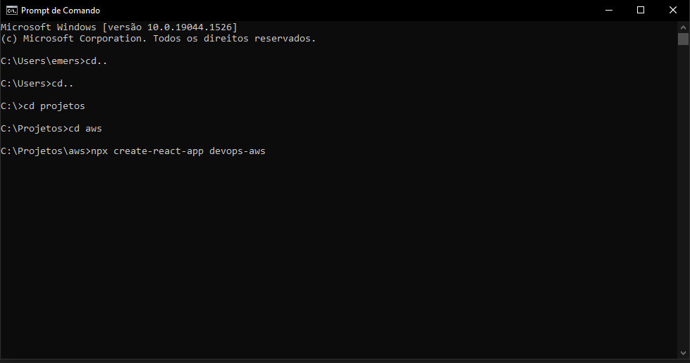
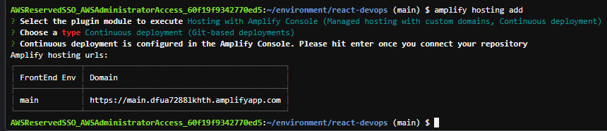

# Deploy de uma aplicação React em ambiente AWS Amplify

1. Primeiro você precisará instalar o **NodeJS** em sua máquina. Acesse [https://nodejs.org](https://nodejs.org/en/) e siga os passos para baixar e instalar.

2. Para criar uma aplicação React abra o terminal e digite o comando `npx create-react-app devops-aws` e aperte **Enter** e aguarde a instalação acabar.




3. Após a instalação do React todos as arquivos necessários para rodar a aplicação estarão no diretorio **/devops-aws**. Digite `cd devops-aws` e depois digite `npm start` para rodar a aplicação em [http://localhost:3000](http://localhost:3000)


4. No terminal aperte `Ctrl + C` ou `Command + C` no MAC, assim você não estará mais rodando seu projeto em localhost:3000 

5. Você precisará de uma conta no github para continuar. Caso não tenha uma conta acesse [https://github.com/](https://github.com/)

6. Agora dentro do github crie um novo repositório com o nome que quiser. Aqui usei react-devops


7. Agora vamos subir seu projeto React para este repositório no github. Digite os 3 comandos abaixo no terminal.


8. Verifique se os arquivos subiram para seu repositório no github.


9. Pronto agora já temos o projeto um projeto React no github. Agora vamos trabalhar com estrutura Cloud na AWS para integrar nosso projeto ao Amplify. Faça login no seu console da AWS https://console.aws.amazon.com/

10. Na barra de busca superior busque por **Cloud9**. No canto superior direito clique em `create environment`

11. Crie um ambiente para a IDE com as configurações abaixo


12. Após criar um ambiente e abrir o Cloud9 no terminal do Cloud9 clone o repositorio do github como a imagem abaixo


13. Agora vamos precisar aumentar a capacidade de armazenamento deste ambiente Cloud para suportar nosso projeto. Acesse https://raw.githubusercontent.com/emegit120/react-devops/main/resize.sh e salve este arquivo em seu computador com **Ctrl + S ou Command + S**


14. Vá até seu github no repositório do seu projeto Clique em **Add file > Upload files**. Selecione o arquivo que baixou na sua maquina **resize.sh** e clique em `Commit changes`


14. Volte ao Cloud9 e no terminal digite `git pull` o arquivo **resize.sh** surgirá no seu projeto


14. Execute o arquivo com o comando no terminal `sh resize.sh`. Aguarde a execução. Pronto agora temos mais espaço em disco.

15. Digite o comando `npm install -g c9` para baixar a extenãp que ajudará o Cloud9 a lidar melhor com o como abrir arquivos no IDE.

16. Execute o comando `npm install -g @aws-amplify/cli` para instalar o serverless framework.

17. Vamos criar um usuario para executar serviços no amplify. Para iniciar o processo execute o comando `amplify configure`

18. Precione enter para confirmar que esta como administrador. Então selecione `us-east-1` no seletor de região. E no ultima parte desse passo ele pergunta o nome do usuario a ser criado para o amplify. De o nome de `amplify-user`. Ele irá mostrar uma URL, clique nela para ir a outra página do console AWS onde irá criar o usuario. NÃO CLIQUE ENTER.


19. Avance na página de permissões se estiver como na imagem Clique em `Próximo Tags` e depois em `Próximo: Revisar` em seguida em `Criar usuário`:


20. Acabamos de criar um usuário com acesso ao amplify copie os 2 valores em um bloco de notas **ID da chave de acesso** e **Chave de acesso secreta**. Volte ao Cloud9 e pressione **Enter**

21. Cole o **ID da chave de acesso -> accessKeyId** e aperte Enter cole o **Chave de acesso secreta -> secretAccessKey** e aperte Enter em **Profile Name** coloque `amplify-user`


23. Agora vamos integrar o amplify ao projeto. no Cloud9 execute o comando `amplify init` digite o nome do seu projeto e depois aperte **Y** e Enter para confirmar


24. Selecione `AWS access keys` como meio de acesso e novamente cole as credenciais do passo 21 e selecione a região `us-east-1`.

25. Após esse processo o amplify vai criar a base do projeto na sua conta AWS utilizando cloudformation. É possivel ver o status do projeto com o comando `amplify status`


26. Agora faremos a criação do hosting no S3 e integração continua com o amplify. Digite o comando `amplify hosting add`
    1. Selecione `Hosting with Amplify Console (Managed hosting with custom domains, Continuous deployment)`
    2. Em 'Choose a type' selecione Continuous `deployment (Git-based deployments)`
    3. Vá até o console AWS e busque por **Amplify**
    
    4. Entre no seu projeto e selecione a aba `Hosting Environments` Selecione o **GitHub** e clique em **Connect branch** na lateral inferior direita.
    
    5. Selecione o projeto postagram e a branch que quiser. Clique em **Next**.
    
    6. Selecione o projeto postagram e a branch que quiser. Clique em **Next**.
    7. Selecione **Environment** como `dev` e marque a opção `Enable full-stack continuous deployments (CI/CD)` e depois clique no botão `Create new role` você será direcionado ao console para criar a role.
    8. Em **Casos de uso para outros serviços da AWS:** selecione `Amplify` marque a caixa `Amplify - Backend Deployment` e clique em **Próximo**
    
    9. Clique em **Próximo**
    
    10. Crie um nome para sua função role e clique em **Criar**
    
    11. Volte ao amplify aperte em refresh e selecione a role que acabou de criar e clique em **Next**
    
    12. Agora clique em  **Save and deploy**
    
    13. Seu primeiro deploy acaba de acontecer.
    

27. Vá para o Cloud9 a aperte **Enter**


28. Digite os comandos `git add -A` e depois `git status` para visualizar os novos arquivos de configuração


29. Digite os comandos abaixo
```
  git add -A
  git status
  git commit -m "adding hosting with amplify"
  git push origin main
  ```


30. O Cloud9 irá pedir acesso ao repositório no github, Vá para o github acesse **Settings ->  Developer settings -> Personal access tokens -> Generate new token** crie um nome para seu token dê todas as permissões e clique em `Generate token` copie o token criado em um bloco de notas.


31. Volte ao Cloud9 em Username digite o E-mail cadastrado no github e no Password cole o token gerado


32. Após conceder a autorização o amplify fará o deploy automaticamente e rodará o pipeline


33. Acessando menu **Build settings** Vemos a configuração do pipeline que será executada toda vez que o comando git push for executado na branch main


34. Na aba da aplicação temos o campo **Domain** onde a aplicação estará rodando na web


34. Aplicação

  
## Considerações finais

Em poucos passos já temos um ótimo ambiente Cloud seguro e configurado para desenvolvimento de qualquer aplicação.

Notamos que ao utilizar serviços do Amplify e S3 nossa aplicação fica largamente escalável pois varios profissionais podem trabalhar ao mesmo tempo na mesma aplicação fazendo alterações rapidamente.

Os logs no deploy do Amplify servem como uma forma de identificar rapidamente algum problema em algum código tanto no front como no back-end.

Sem dúvidas utilizar o deploy do Amplify e a hospedagem S3 faz com que equipe desenvolvimento e infraestrutura tenham mais produtividade no dia a dia.
